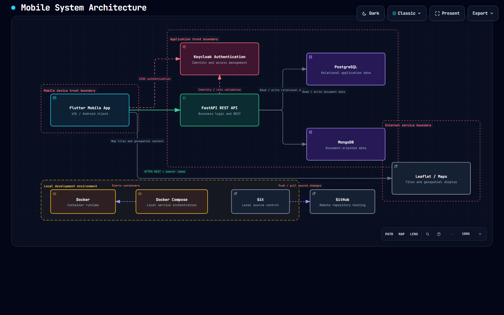
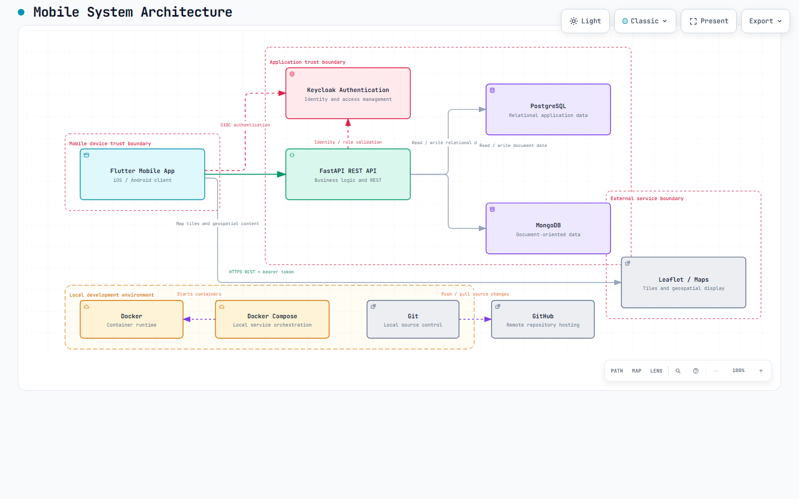
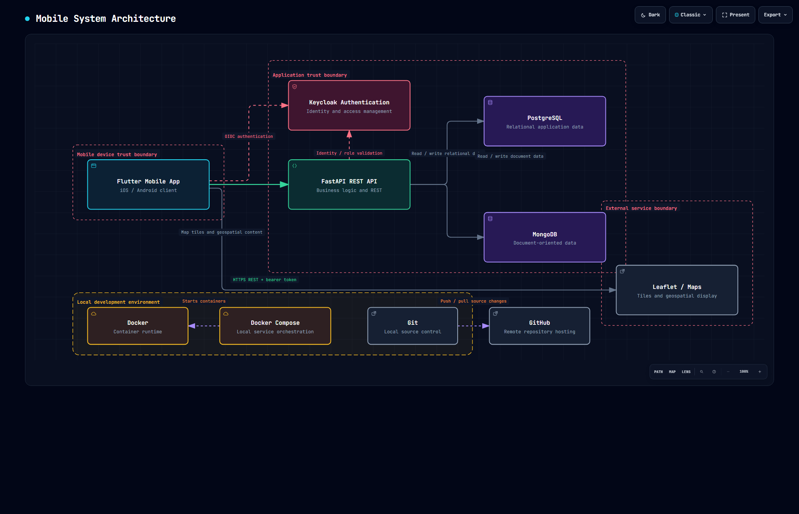
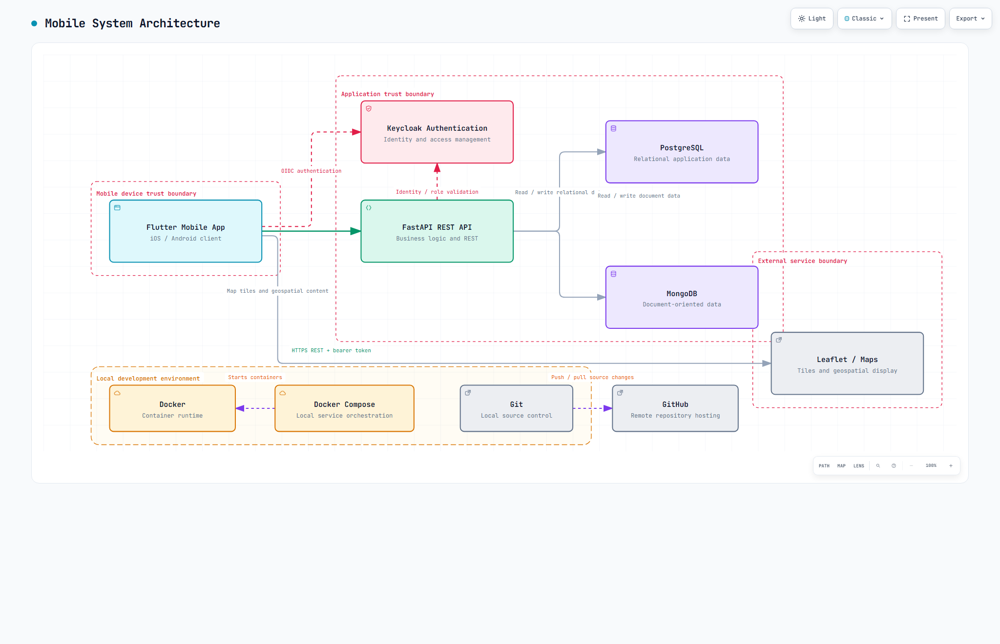

# Práctica 2: Boceto de Arquitectura de Proyecto Integrador con Archify

  

## Descripción

En esta práctica se instaló y configuró el agente de modelado arquitectónico Archify, integrado con el entorno de Codex CLI para generar una representación visual del sistema del Proyecto Integrador. El resultado fue un diagrama interactivo y autónomo en formato HTML, diseñado para mostrar la estructura funcional del proyecto, los servicios involucrados, las capas de seguridad y la relación entre componentes clave del sistema.

La propuesta modelada responde a la arquitectura general del proyecto integrador, contemplando autenticación, servicios, almacenamiento de datos, integración con plataformas externas y estructura de despliegue y operación.

---

## Objetivo

Instalar, configurar y ejecutar Archify junto con Codex AI para diseñar y publicar un boceto de arquitectura del Proyecto Integrador, con enfoque en la representación visual, claridad técnica y disponibilidad de la documentación como recurso interactivo para revisión y presentación.

---

## Actividades Realizadas

### 1. Instalación y configuración del entorno

- Instalación global de Codex CLI mediante npm.
- Registro del skill de Archify en el entorno de trabajo del agente.
- Preparación del repositorio para la generación del modelo arquitectónico.

### 2. Generación del modelado arquitectónico

- Definición del stack tecnológico del proyecto integrador.
- Especificación de capas principales: autenticación, backend, datos y servicios externos.
- Detalle de límites de confianza y puntos de integración.
- Generación del diagrama interactivo en formato HTML con estructura visual navegable.

### 3. Publicación y documentación

- Almacenamiento del artefacto generado dentro del repositorio.
- Organización de evidencia visual y técnica.
- Publicación del diagrama en GitHub Pages para consulta en línea.
- Inclusión de documentación formal en formato PDF dentro de la carpeta de evidencias.

---

## Componentes modelados del sistema

### Capa de acceso y autenticación
- Gestión de identidad y acceso segura.
- Control de autenticación y autorización.

### Capa de servicios y lógica de negocio
- APIs y servicios internos del proyecto integrador.
- Organización de la lógica funcional del sistema.

### Capa de datos
- Almacenamiento relacional y no relacional.
- Administración de información estructurada y documental.

### Servicios externos
- Integración con herramientas y plataformas complementarias.
- Conexión con servicios de terceros requeridos por el proyecto.

### Infraestructura y despliegue
- Contenedores y servicios de soporte.
- Entorno de desarrollo y publicación con Git y GitHub.

---

## Diagramas y recursos generados

La práctica incluye un conjunto de archivos que permiten visualizar, analizar y documentar el diseño arquitectónico del proyecto:

- [Diagrama interactivo principal](./index.html)
- [Diagrama arquitectónico detallado](./mobile-system-architecture.html)
- [Archivo JSON del modelo](./mobile-system-architecture.json)
- [Documento de evidencias PDF](./Documento%20de%20evidencias%20-%20Practica02.pdf)
- [Reporte visual de validación](./mobile-system-architecture.visual-check.html)

### Acceso en línea (GitHub Pages)

- [Ver diagrama interactivo de arquitectura en GitHub Pages](https://jesuuusart.github.io/Practicas_INTEGRADORA_220772/Practica02/)

La visualización interactiva permite navegar entre componentes, entender la relación entre capas y evaluar la estructura del sistema desde una perspectiva funcional y técnica.

---

## Evidencia visual

A continuación se muestran las capturas generadas como evidencia del diagrama arquitectónico de la práctica 2:

### Captura 1 — 1440x900 (modo oscuro)

  

> 💡 Dar clic en la imagen abre el diagrama interactivo en GitHub Pages.

### Captura 2 — 1440x900 (modo claro)

  

### Captura 3 — 2048x1320 (modo oscuro)

  

### Captura 4 — 2048x1320 (modo claro)

  

---

## Resultados y documentación

La entrega final de la práctica queda documentada en los siguientes recursos:

### Enlaces del proyecto

- [Ver diagrama interactivo de arquitectura en GitHub Pages](https://jesuuusart.github.io/Practicas_INTEGRADORA_220772/Practica02/)
- [Descargar PDF de evidencia desde GitHub Pages](https://jesuuusart.github.io/Practicas_INTEGRADORA_220772/Practica02/Documento%20de%20evidencias%20-%20Practica02.pdf)

### Evidencia del trabajo

La práctica demuestra la capacidad para:

- conceptualizar una arquitectura distribuida;
- identificar capas, servicios y dependencias;
- representar flujos entre componentes del proyecto;
- documentar el sistema de forma clara y visual;
- publicar resultados de manera accesible en GitHub Pages.

---

## Conclusión

La Práctica 2 consolidó el proceso de análisis y diseño arquitectónico del proyecto integrador, integrando herramientas modernas de IA y diagramación para convertir una especificación técnica en una vista visual organizada, profesional y funcional. El resultado final no solo documenta la solución, sino que también facilita la comunicación técnica del sistema ante docentes, compañeros y revisores del proyecto.
