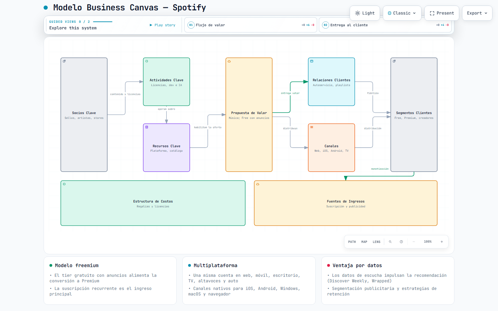
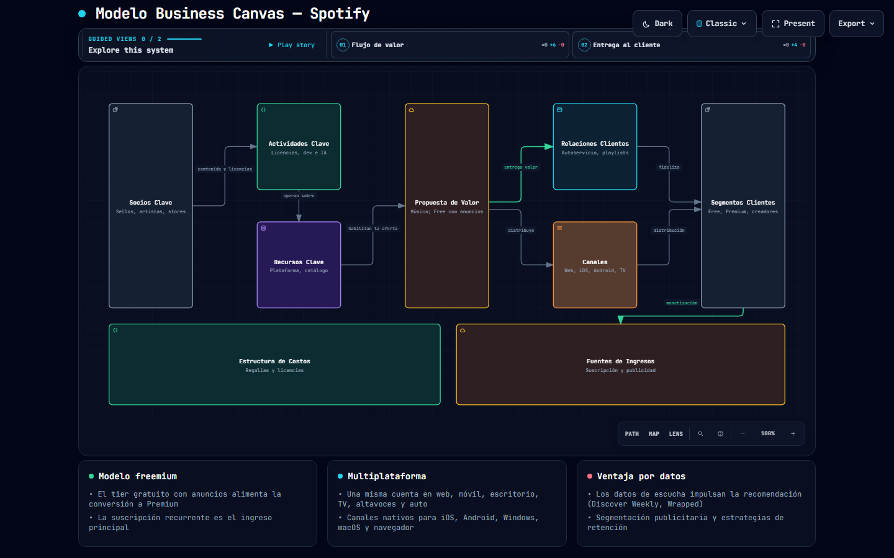
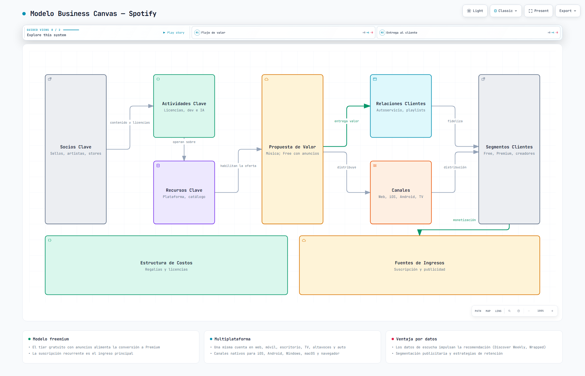
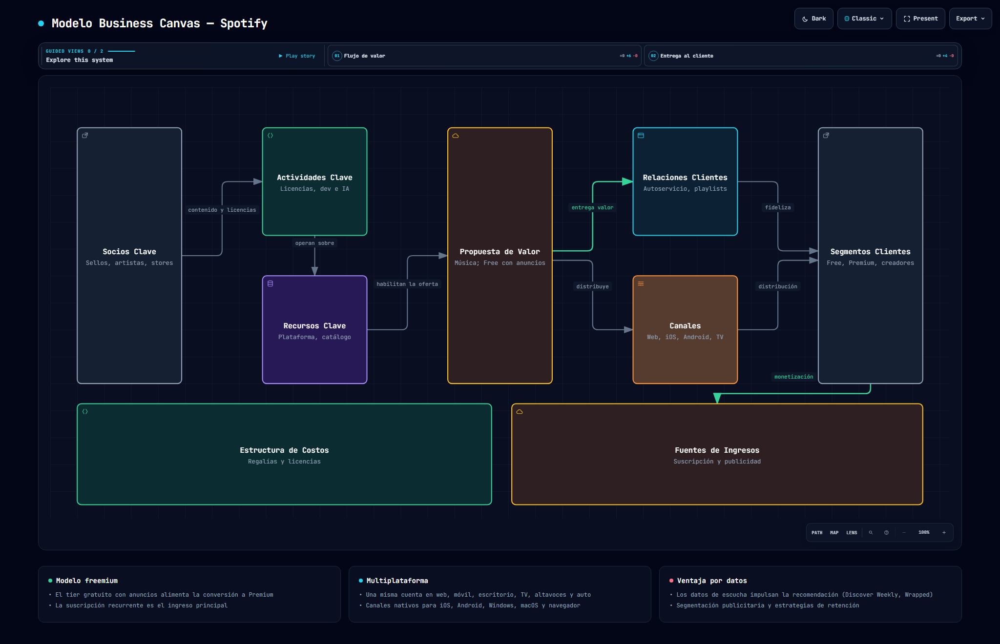

# Práctica 3: Boceto de Modelo Canvas con Archify

  

## Descripción

En esta práctica se utilizó el agente de modelado arquitectónico Archify para generar un **Business Model Canvas** interactivo y autónomo en formato HTML para **Spotify**, un servicio multiplataforma de streaming musical y de podcasts que forma parte de la vida cotidiana de muchos usuarios a través de web, móvil, escritorio, Smart TV, altavoces inteligentes y sistemas de infoentretenimiento para automóviles.

El resultado es un modelo visual de los 9 bloques del canvas (segmentos de clientes, propuesta de valor, canales, relaciones, fuentes de ingreso, recursos clave, actividades clave, asociaciones clave y estructura de costos), acompañado del proceso de iteración del prompt: una **versión v1** y una **versión mejorada v2** que corrigió problemas de legibilidad y composición detectados al revisar el modelo generado.

---

## Objetivo

Redactar y estructurar un *prompt* en lenguaje natural para que Archify genere el Business Model Canvas de una herramienta multiplataforma real, revisar el modelo obtenido, editar el prompt para mejorar el resultado y documentar la entrega en el repositorio aplicando buenas prácticas de organización y versionado.

---

## Actividades realizadas

### 1. Elección de la aplicación multiplataforma

Se seleccionó **Spotify** por ser una plataforma multiplataforma ampliamente utilizada en la vida cotidiana (web, iOS, Android, escritorio, Smart TV, altavoces y automóviles) y por contar con un modelo de negocio documentado y fácil de interpretar en los nueve bloques del Business Model Canvas: *freemium*, suscripciones recurrentes y publicidad.

### 2. Estructuración del prompt para Archify

Se redactó un prompt inicial (`prompt-v1.md`) que describe:

- el tipo de diagrama (`architecture`) y perfil de calidad (*showcase*);
- la retícula estándar del canvas con los 9 bloques;
- el contenido de cada bloque basado en el modelo de negocio real de Spotify;
- las relaciones semánticas entre bloques;
- las tarjetas de resumen y el idioma del contenido.

### 3. Revisión del modelo obtenido

El primer modelado (`spotify-canvas-v1.json`) se validó con el comando `archify validate`. La revisión evidenció múltiples problemas de composición:

- sub-etiquetas demasiado largas que no cabían en bloques de 240 px;
- etiquetas de relación que se solapaban sobre los componentes;
- segmentos de enrutamiento demasiado cortos o que cruzaban bloques no relacionados;
- escalado inferior a 6 px de legibilidad mínima en escritorio (viewBox de 2040 px).

### 4. Edición del prompt para mejorar el resultado

Con base en la revisión anterior se redactó el prompt mejorado (`prompt-v2.md`) que:

- redujo las sub-etiquetas a un máximo aproximado de 45 caracteres;
- amplió los bloques y los pasillos entre columnas a 140 px para dar espacio a las etiquetas;
- compactó el viewBox (1335 × 640) para garantizar legibilidad en 1440×900;
- reordenó y simplificó las relaciones para evitar cruces y superposiciones;
- reposicionó etiquetas conflictivas mediante `labelDy` y lados de salida explícitos.

El resultado `spotify-canvas.json` pasó la validación *showcase* con **9/9 verificaciones, 0 errores y 0 advertencias**, y la entrega del HTML fue aceptada.

### 5. Documentación y buenas prácticas

Se documentó el proceso completo (prompts, iteraciones, validación y resultados), se agregaron evidencias visuales en modos claro/oscuro y se publicó el diagrama interactivo en GitHub Pages, siguiendo la misma estructura de la práctica 02.

---

## Comparativa entre iteraciones del prompt

| Aspecto | Prompt v1 | Prompt v2 (mejorado) |
| --- | --- | --- |
| Sub-etiquetas | Largas y con varios elementos | Concisas (~45 caracteres) |
| Ancho de bloques | 240 px | 280 px |
| Separación entre columnas | 20 px | 140 px |
| Etiquetas de relación | Solapadas sobre bloques | En pasillos libres |
| ViewBox | 2040 × 850 | 1335 × 640 |
| Validación showcase inicial | Falla | 9/9 checks, 0 errores |
| Legibilidad 1440×900 | < 6 px | ≥ 6 px (pass) |

---

## Modelo Canvas generado

El Business Model Canvas de Spotify se distribuye en los 9 bloques estándar:

### Socios Clave
- Sellos discográficos (Sony, Universal, Warner).
- Artistas y podcasters.
- Apple y Google (app stores).
- Fabricantes de hardware (Samsung, Sonos, automotrices).

### Actividades Clave
- Gestión de licencias y catálogo.
- Desarrollo de la plataforma multiplataforma.
- Algoritmos de recomendación (IA).
- Venta de publicidad.

### Recursos Clave
- Plataforma tecnológica y aplicaciones.
- Catálogo musical y de podcasts.
- Datos de escucha.
- Infraestructura cloud/CDN y talento.

### Propuesta de Valor
- Streaming de música y podcasts multiplataforma.
- Tier gratuito con anuncios.
- Premium sin anuncios, offline y en alta calidad.
- Descubrimiento personalizado (Discover Weekly, Wrapped).

### Relaciones con Clientes
- Autoservicio.
- Playlists compartidas y colaborativas.
- Wrapped anual.
- Soporte al cliente.

### Canales
- Web, iOS, Android y escritorio.
- Smart TV, altavoces inteligentes y sistemas de autos (CarPlay/Android Auto).

### Segmentos de Clientes
- Oyentes del plan gratuito.
- Suscriptores Premium (Individual, Dúo, Familiar, Estudiante).
- Anunciantes y creadores.

### Estructura de Costos
- Regalías y pago por reproducción.
- Licencias de contenido.
- Infraestructura cloud y CDN.
- Marketing y personal.

### Fuentes de Ingresos
- Suscripciones Premium (recurrentes).
- Publicidad en el tier gratuito.
- Spotify Audience Network.

---

## Diagramas y recursos generados

- [Diagrama interactivo del Modelo Canvas](./spotify-canvas.html)
- [Prompt v1](./prompt-v1.md)
- [Prompt v2 (mejorado)](./prompt-v2.md)
- [Candidato v1 (JSON)](./spotify-canvas-v1.json)
- [Candidato final (JSON)](./spotify-canvas.json)
- [Reporte de validación visual](./spotify-canvas.visual-check.html)

---

## Evidencia visual

Capturas generadas como evidencia del diagrama interactivo de la práctica 3:

### Captura 1 — 1440x900 (modo claro)

  

### Captura 2 — 1440x900 (modo oscuro)

  

### Captura 3 — 2048x1320 (modo claro)

  

### Captura 4 — 2048x1320 (modo oscuro)

  

---

## Resultados y documentación

- [Ver diagrama interactivo en GitHub Pages](https://jesuuusart.github.io/Practicas_INTEGRADORA_220772/Practica03/)
- [Descargar/ver prompt mejorado](./prompt-v2.md)

La práctica demuestra la capacidad para:

- elegir y analizar una herramienta multiplataforma real;
- redactar y estructurar prompts efectivos para generación modelada con IA;
- interpretar y corregir errores de composición y legibilidad;
- iterar sobre un prompt para mejorar el resultado;
- documentar y publicar el modelo en el repositorio con buenas prácticas.

---

## Conclusión

La Práctica 3 integró el conocimiento previo de Archify (practicado en la práctica 02) con la metodología de modelado de negocios del Business Model Canvas. El ciclo *prompt → modelo → revisión → mejora del prompt → entrega* consolidó un flujo de trabajo reproducible que no solo genera un diagrama profesional, sino que también ejercita el análisis crítico de la calidad del artefacto producido y la documentación ordenada del proceso.